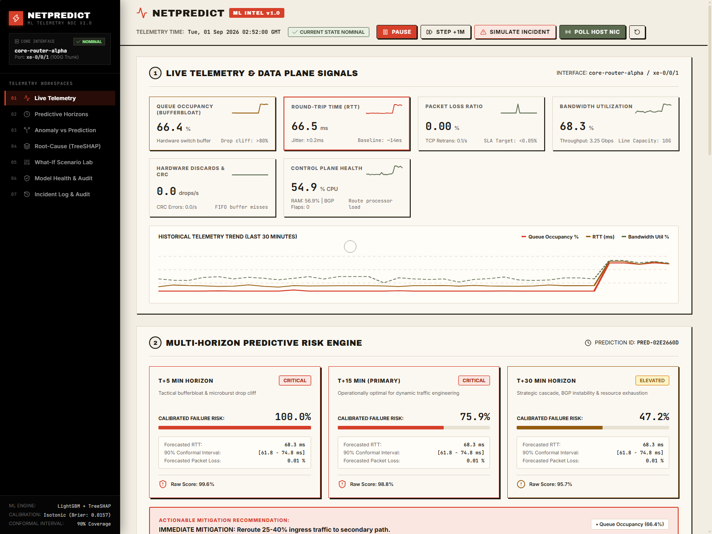

# NetPredict

> An early warning system for network congestion and performance degradation.

[](https://netpredict-cockpit.vercel.app)
[](https://netpredict-docs.vercel.app/docs)
[](https://python.org)
[](https://fastapi.tiangolo.com)
[](https://react.dev)
[](https://typescriptlang.org)
[](https://opensource.org/licenses/MIT)

---

## Overview

Most network monitoring tools (like Datadog, Zabbix, or PRTG) are **reactive**. They only alert engineers after packets have already dropped, a router buffer has overflowed, and users are experiencing disconnects.

**NetPredict is a predictive early warning system.** Instead of waiting for a failure to happen, it analyzes real-time network trends—such as queue buildup and rising latency slopes—to predict congestion **5, 15, and 30 minutes in advance**.



---

## Why This Matters

Think of a network link like a highway:
- **Traditional Monitoring:** Alerts you after a 10-car pileup has already blocked the road.
- **NetPredict:** Notices that cars are beginning to brake and bunch together, predicting a traffic jam 15 minutes before anyone comes to a complete standstill.

By catching queue pressure early, network engineers can reroute traffic, adjust QoS settings, or apply rate limits *before* packet loss impacts users.

---

## Key Features

- **Multi-Horizon Predictions (5m, 15m, 30m):**
  Forecasts risk across three critical operational windows so engineers have enough time to take action.

- **Root-Cause Explainability:**
  Doesn't just output a risk percentage. It shows exactly *why* the risk is elevated (e.g., whether it is driven by queue buildup, TCP retransmissions, or bandwidth spikes).

- **"What-If" Mitigation Simulator:**
  Lets operators test changes before touching production equipment. For example, you can simulate rerouting 20% of traffic or expanding buffer size to see how much the predicted risk drops in real time.

- **Dual Ingestion Engine:**
  - **Live Hardware Polling:** The Python backend includes a built-in collector that can read real network interface counters and measure live socket latency directly from your computer's OS.
  - **Zero-Cost Browser Engine:** When hosted on the web without a dedicated server, the dashboard runs a built-in simulation engine with realistic daily traffic cycles and microbursts so anyone can test it for free 24/7.

- **Clean, Responsive Cockpit:**
  Built with a high-contrast tactile interface designed for quick readability during incidents. Works across desktop, tablet, and mobile devices.

---

## How It Works

```
1. Telemetry Ingestion
   Reads network signals: Bandwidth, Queue Occupancy, Round-Trip Time (RTT), Jitter, and Loss.
          │
          ▼
2. Trend & Rate-of-Change Analysis
   Calculates how fast queues and latency are rising over rolling 5-minute and 15-minute windows.
          │
          ▼
3. Risk Prediction & Explainability
   • Predicts failure probabilities across 5m, 15m, and 30m horizons.
   • Explains key drivers behind the score using feature attributions.
   • Provides a What-If sandbox to test mitigations before taking action.
```

---

## Interactive Dashboard Sections

The dashboard is divided into 7 functional workspaces:

1. **Live Telemetry:** Real-time graphs of bandwidth, queue depth, round-trip time, and packet loss.
2. **Predictive Horizons:** Risk scores and latency estimates for the next 5, 15, and 30 minutes.
3. **Anomaly vs. Prediction:** Distinguishes between brief benign traffic spikes and real impending failures to reduce false alarms.
4. **Root Cause Analysis:** Breaks down which telemetry metrics contributed most to the current risk score.
5. **What-If Scenario Lab:** Interactive sliders to test traffic diversion and queue limits with instant feedback.
6. **Model Health & Stability:** Displays model calibration and prediction accuracy metrics.
7. **Incident Log:** Searchable history of detected congestion events and triage timestamps.

---

## Quick Start

You can explore NetPredict in three ways:

### 1. Try the Live Web App (No setup required)
- **Live Cockpit:** [https://netpredict-cockpit.vercel.app](https://netpredict-cockpit.vercel.app)
- **Documentation Portal:** [https://netpredict-docs.vercel.app/docs](https://netpredict-docs.vercel.app/docs)

---

### 2. Run with Docker Compose (Recommended for local testing)
Clone the repository and start both backend and frontend with one command:

```bash
git clone https://github.com/The-AnkitPatel/NetPreditct.git
cd NetPreditct
docker compose up --build
```
- Open the Dashboard: `http://localhost:5173`
- Open the API Docs: `http://localhost:8000/docs`

---

### 3. Run Locally (Step-by-Step)

#### Prerequisites
- Python 3.12+
- Node.js 20+

#### Step A: Backend
```bash
# Navigate to project root
cd NetPreditct

# Create and activate virtual environment
python -m venv .venv

# On Windows:
.venv\Scripts\activate
# On macOS/Linux:
source .venv/bin/activate

# Install dependencies
pip install -r backend/requirements.txt psutil

# Run unit tests
pytest backend/tests -v

# Start backend server
uvicorn backend.app.main:app --port 8000 --reload
```

#### Step B: Frontend
```bash
# In a separate terminal
cd frontend
npm install
npm run dev
```
Open `http://localhost:5173` in your browser.

---

## Project Structure

```
NetPredict/
├── backend/
│   ├── app/
│   │   ├── api/             # FastAPI REST endpoints (telemetry, predictions, what-if)
│   │   ├── collectors/      # Host NIC hardware collector (psutil + socket latency)
│   │   ├── ml/              # Prediction models, anomaly detection, explainability
│   │   └── services/        # Sliding-window buffer and feature extraction
│   ├── tests/               # Pytest automated test suite
│   ├── Dockerfile           # Backend container definition
│   └── requirements.txt     # Python dependencies
├── frontend/
│   ├── src/
│   │   ├── components/      # React UI panels and controls
│   │   ├── services/        # API client and client-side fallback engine
│   │   └── types/           # TypeScript data interfaces
│   ├── Dockerfile           # Frontend container definition
│   └── package.json
├── docs-portal/             # Complete Next.js documentation portal
├── docs/screenshots/        # Dashboard screenshots
├── docker-compose.yml       # Docker Compose setup
└── README.md
```

---

## Author & License

- **Author:** [Ankit Patel](https://github.com/The-AnkitPatel)
- **License:** [MIT License](LICENSE) — free to use, modify, and build upon for educational, academic, and practical use.
