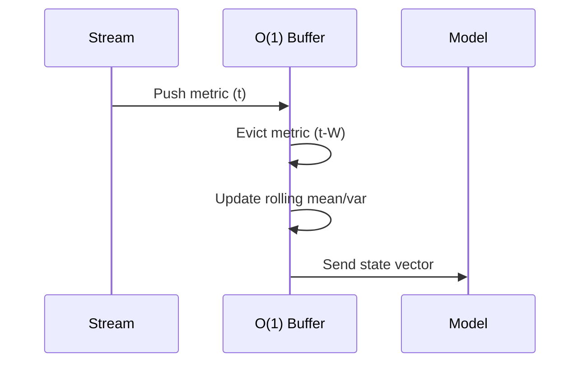

# Sliding Window State Machine

Predicting network failures requires looking at a window of history $W = [t-k, t]$. 

## Temporal Window Slicing
Instead of recomputing aggregations over the entire window for every new packet, we maintain rolling states (sum, max, min).

> [!info] O(1) Rolling Updates
> $S_{t} = S_{t-1} + x_t - x_{t-W}$

This feeds directly into our [[Multi-Horizon LightGBM]] model for T+n predictions.
