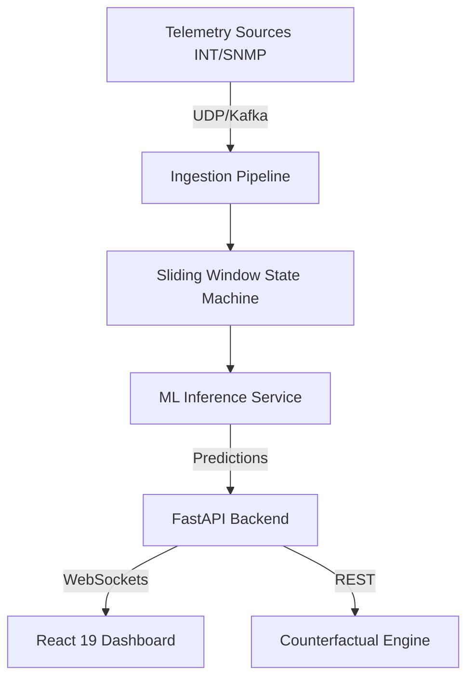

# System Architecture

NetPredict follows a strict hexagonal/clean architecture, separating the core domain (network telemetry & prediction) from infrastructure (databases, APIs).

> [!tip] Tech Stack
> - **Frontend**: React 19 (concurrent rendering for real-time dashboards)
> - **Backend**: FastAPI (async I/O for high-throughput metrics)
> - **ML Layer**: Python / LightGBM

## Architecture Diagram

## Core Components
1. **[[Data Plane & Ingestion Pipeline]]**: Captures incoming streams.
2. **[[Sliding Window State Machine]]**: Buffers state efficiently.
3. **[[Multi-Horizon LightGBM]]**: Runs inference based on state.
