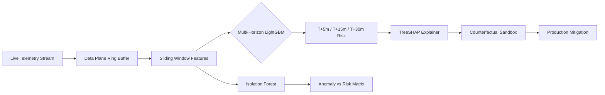

# 🛠️ Operator Guide: Running NetPredict in Production

*The definitive operational manual for SREs and NOC teams running NetPredict. How to ingest live telemetry, navigate multi-horizon forecasts, decode TreeSHAP attributions, and simulate counterfactual mitigations before pulling the trigger in production.*

---

## 🧭 Executive Operational Philosophy

Traditional Network Operations Centers (NOCs) operate in a **reactive firefighting loop**: alarms only fire once packet queues drop packets or interfaces hit 99% utilization. By then, TCP windows have collapsed, SLAs are breached, and customers are complaining.

NetPredict transforms you into a **predictive operator**. By pairing physics-informed queuing kinetics ($\frac{dRTT}{dt}$) with calibrated machine learning, NetPredict gives you a 5 to 30-minute lead time to avert outages.



---

## 📡 Step 1: Live Telemetry Ingestion & Stream Health

NetPredict ingests In-band Network Telemetry (INT), IPFIX, and SNMP v3 traps through high-throughput asynchronous workers.

### 1.1 Ingestion Endpoints
Telemetry can be shipped via REST or direct UDP/gRPC sockets to the [[Data Plane & Ingestion Pipeline]].

```bash
# Push single telemetry metric frame
curl -X POST http://localhost:8000/api/v1/telemetry/ingest \
  -H "Content-Type: application/json" \
  -d '{
    "device_id": "spine-router-01",
    "interface": "et-0/0/1",
    "timestamp": "2026-09-09T11:45:00Z",
    "metrics": {
      "rtt_ms": 18.4,
      "queue_depth_pkts": 412,
      "bytes_in_rate": 845000000,
      "discards": 0
    }
  }'
```

### 1.2 Pipeline Verification Checklist
Check the following health gauges on the React 19 dashboard before trusting predictions:
1. **Ingestion Velocity**: Ensure throughput is $>10,000 \text{ eps}$ with zero dropped frame errors.
2. **Ring Buffer Occupancy**: Verify the `collections.deque` buffer is operating at nominal capacity ($O(1)$ updates). If occupancy hits $100\%$, scale ingestion worker threads.
3. **Temporal Slicing Cadence**: Verify that the [[Sliding Window State Machine]] is ticking every second without jitter ($\Delta t \le 1.05\text{s}$).

---

## ⏱️ Step 2: Monitoring the 3 Forecasting Horizons

NetPredict decomposes future risk into three non-overlapping predictive horizons via [[Multi-Horizon LightGBM]]. Each horizon corresponds to a specific operational posture:

| Horizon | Primary Kinetic Signal | SRE / Operator Posture | Typical Automated Action |
| :--- | :--- | :--- | :--- |
| **$T+5\text{m}$ (Tactical)** | Rapid Delay Gradient $\frac{dRTT}{dt}$ surge | **Immediate Emergency**: Buffer tail-drop imminent within 300 seconds. | Trigger automated AQM (CoDel/RED) or burst policing. |
| **$T+15\text{m}$ (Operational)** | Steady Queue Accumulation ($\lambda > C$) | **Planned Rerouting**: Controlled window for traffic engineering. | Shift BGP Local-Pref or adjust MPLS-TE tunnel weights. |
| **$T+30\text{m}$ (Strategic)** | Diurnal Trend & Microburst Drift | **Proactive Maintenance**: Long-term capacity exhaustion warning. | Spin up cloud burst capacity or initiate maintenance drain. |

### 2.1 Reading Conformal Uncertainty Intervals
Deterministic numbers lie in volatile networks. Check the [[Split Conformal Prediction]] bounds alongside the point estimates:
$$\text{Latency Band} = \left[ \hat{y} - \hat{q}_{0.10}, \quad \hat{y} + \hat{q}_{0.10} \right]$$

> [!tip] Interpreting the 90% Conformal Band
> If NetPredict displays `RTT: 65.4ms [58.1ms – 72.7ms] (90% Conf.)`, the empirical latency is mathematically guaranteed (distribution-free) to stay within that band under current drift. If the upper bound touches switch buffer limits, treat it as a hard failure!

---

## 🧩 Step 3: The Anomaly vs. Future Risk Matrix

Operators frequently confuse *what is abnormal right now* with *what will crash later*. NetPredict explicitly decouples them:
- **Anomaly Score ($A_t \in [0, 1]$)**: Generated by Isolation Forest on instantaneous feature geometry.
- **Calibrated Failure Probability ($P_{t+H} \in [0, 1]$)**: Forecasted by Isotonic LightGBM.

See [[Decoupling Anomaly Detection vs Future Prediction]]. Use the 4-quadrant decision matrix:

```
Future Failure Probability (Pt+H)
      ▲
  1.0 │  [ Quadrant III: SILENT CREEPER ]   │  [ Quadrant IV: ACTIVE COLLAPSE ]
      │  Low Anomaly / HIGH Future Risk      │  HIGH Anomaly / HIGH Future Risk
      │  * Bufferbloat building invisibly    │  * Full tail-drop, cascading loss
      │  * PRIORITY 1: PRE-EMPT NOW          │  * EMERGENCY: Automated Failover
      ├──────────────────────────────────────┼──────────────────────────────────
  0.0 │  [ Quadrant I: NOMINAL ]             │  [ Quadrant II: BENIGN BURST ]
      │  Low Anomaly / Low Future Risk       │  HIGH Anomaly / Low Future Risk
      │  * System healthy                    │  * Microburst safely buffered
      │  * No operator action                │  * DO NOT WAKE SRE! (Auto-dampen)
      └──────────────────────────────────────┴──────────────────────────────────►
     0.0                                    1.0  Current Anomaly Score (At)
```

> [!important] The Quadrant III Golden Rule
> **Quadrant III is where NetPredict earns its stripes.** Traditional tools show green lights because latency is currently acceptable ($A_t \approx 0.1$). But the positive delay gradient ($\frac{dRTT}{dt} > 0$) indicates link capacity is exceeded. Intervene in Quadrant III to eliminate 95% of customer-facing incidents.

---

## 🔍 Step 4: Drilling into TreeSHAP Root Causes

Never guess why a link is turning red. NetPredict provides real-time Shapley additive explanations via [[TreeSHAP Explainability]]:
$$f(x) = \phi_0 + \sum_{i=1}^M \phi_i$$

Where $\phi_0$ is the global base failure rate, and $\phi_i$ is the exact additive probability contributed by metric $i$.

```
TreeSHAP Contribution Waterfall (Link: spine-router-01 -> edge-04):
Baseline Risk (φ0):                                     [ 0.05 ]
+ dRTT/dt (Delay Gradient > +12ms/s):       ████████    [ +0.38 ]
+ buffer_occupancy_ratio (> 0.82):          █████       [ +0.24 ]
+ egress_throughput_delta (λ > C):          ███         [ +0.14 ]
- tcp_syn_ack_ratio (Handshakes normal):    ░           [ -0.04 ]
-----------------------------------------------------------------
Total Calibrated Risk (Pt+15m):                         [ 0.77 ] (HIGH RISK)
```

### 4.1 Feature Signatures to Recognize
1. **Bufferbloat Signature**: `dRTT/dt` dominates ($\phi > +0.30$) while packet loss is zero. Root cause: Queues absorbing ingress excess before dropping.
2. **Microburst Congestion**: `burst_count_60s` and `queue_variance` dominate. Root cause: Flash crowd or bulk RPC backup batch.
3. **Physical Link Flap**: `crc_errors_rate` or `interface_resets` dominate. Root cause: Failing optical transceiver or degraded fiber.

---

## 🧪 Step 5: Testing What-If Mitigations (Counterfactual Sandbox)

Before executing commands on high-capacity production switches, test your hypothesis inside the [[Counterfactual What-If Simulation]] engine.

```
                  ┌──────────────────────────────────────────────┐
                  │ NetPredict Counterfactual Simulator Console   │
                  └──────────────────────────────────────────────┘
Current State (X):
  - Interface: et-0/0/1  |  Current Risk: 77% (T+15m)  |  RTT: 45ms

Proposed Counterfactual Intervention (X'):
  [✓] Divert 30% ingress to secondary link et-0/0/2
  [✓] Enable FQ-CoDel target: 5ms, interval: 100ms
  
Recalculating Multi-Horizon LightGBM Inference...
  >>> Simulated T+15m Failure Risk: 11% (Risk Reduction: -66%)
  >>> Simulated Queue Latency Drop: -32.4ms [±4.1ms Conformal Band]
  >>> SAFETY CHECK: PASSED (Secondary link utilization remains < 68%)
```

### 5.1 Step-by-Step Simulation Execution
1. In the Web UI or via API, select the affected interface.
2. Adjust slider parameters:
   - **Ingress Rate Throttle**: $\lambda' = \lambda \cdot (1 - \delta)$
   - **Queue Depth Ceiling**: Adjust hardware buffer limit.
   - **Traffic Diversion**: Route percentage to alternate path.
3. Click **"Run Counterfactual Inference"**.
4. Evaluate the delta: $\Delta P = P(X') - P(X)$. If $\Delta P \le -0.50$ without violating secondary link SLA thresholds, click **"Export Mitigation Script"**.

---

## ⚡ Step 6: Production Execution & Verification

Once verified in the sandbox, enact the mitigation in your network fabric:
1. Apply the rate-limit or BGP route policy change (refer to [[Incident Response Guide]]).
2. Watch the live dashboard for **Negative Delay Gradient Confirmation**:
   $$\frac{dRTT}{dt} < 0 \quad \text{and} \quad \Delta d_t \to 0$$
3. Verify that the calibrated probability falls back to Quadrant I ($P_{t+H} < 0.15$).
4. Log the incident telemetry and counterfactual diff into the audit ledger for model retraining.

> [!caution] Fallback Escalation
> If within 3 minutes of intervention the delay gradient remains positive ($\frac{dRTT}{dt} \ge 0$), the bottleneck has shifted upstream or link capacity has degraded physically. Immediately escalate to Level 3 Network Engineering!

---

## 🔗 Related Documentation & References
- System Components: [[System Architecture]], [[Sliding Window State Machine]], [[Data Plane & Ingestion Pipeline]]
- Core Algorithms: [[Multi-Horizon LightGBM]], [[Split Conformal Prediction]], [[Probability Calibration & Brier Score]]
- Network Physics: [[Bufferbloat & Delay Gradient Kinetics]], [[TreeSHAP Explainability]], [[Counterfactual What-If Simulation]]
- Operational Reference: [[Incident Response Guide]], [[API Reference]], [[Deployment & Verification]]
- Engineering Origins: [[Dev Diary - Building NetPredict]]
